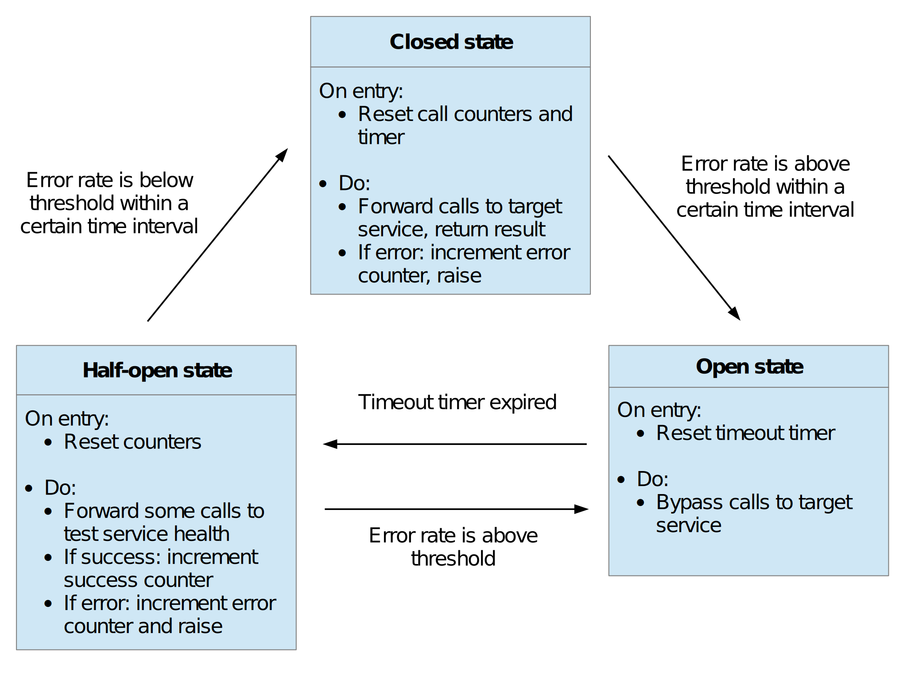

# Circuit breaker

A circuit breaker is a software pattern by which an application temporarily
stops making requests to a service that starts failing.

This helps preventing wasting resources on a faulty service, and can help the
service recover.

## What problem does the circuit breaker solve?

In a distributed system, each service may be making calls to multiple other
services. Calls may take more time than usual to succeed or event fail because
of multiple reasons: the network is congested, a service is busy and slow to
respond, a service is down and does not respond to calls at all, etc.

Call retries can mitigate some of these issues, but this assumes that failures
are transient. In some cases, e.g. if a service is down, it is better to assume
that the issue will remain for some time and stop sending calls to this service
until it is back online. This helps prevent cascading failures, such as when
retries and timeouts lead to latency propagating through the system, and call
retries consume CPU cycles, threads, connections, etc.

A circuit breaker avoids sending calls to a failing service by monitoring call
failures. When the failure rate is high enough, the circuit breaker is
triggered and calls are bypassed, preventing repeated calls that are likely to
fail. Conversely, the circuit breaker can also detect when the service
recovers, and then start sending calls to this service again.

## How does the circuit breaker work?

A circuit breaker is like a proxy for operations that may fail. It monitors the
rate of recent failures, and then decides if the operation should be carried
out or "fail fast" and return an exception.

Typically, a circuit breaker has three states:

* Closed: All operations received by the circuit breaker are carried out, e.g.
    service calls are forwarded to the target service. The rate of recent
    failures is monitored, and if the rate is above a defined threshold, the
    circuit breaker moves to the 'open' state. After a specified time interval,
    the failure rate monitor resets, so that only recent operations are taken
    into account.

* Open: All operations fail immediately. Upon entering the 'open' state, a
    timeout time starts. When this timer expires, the circuit breaker moves to
    the 'half-open' state. This timeout allows to fix problems that caused the
    circuit breaker to open before operations are tried again.

* Half-open: The circuit breaker fails most operations immediately, but allows
    a certain number of them to pass through to test health recovery. If enough
    of these operations are successful, the circuit breaker moves to the
    'closed' state. Otherwise, it moves back to the 'open' state. The 'half-open'
    state prevents issues that could arise by suddenly sending a lot of
    requests to a service in the middle of a recovery.



## Implementation

A circuit breaker was [implemented]("../pastebin/src/circuit_breaker.py") to
monitor calls to a Redis cache.

This circuit breaker is implemented as a Python class where the `__call__`
method returns a wrapper to a function, allowing circuit breaker instances to
be used as a function decorator:

```
from .circuit_breaker import (
    AsyncCircuitBreaker,
    CircuitBreakerBypass,
    CircuitBreakerException,
)

cb = AsyncCircuitBreaker()


@cb
async def call_redis():
    try:
        # do stuff
    except (CircuitBreakerBypass, CircuitBreakerException) as err:
        # do more stuff, e.g logging, return a fallback response, etc.
```

When the circuit breaker catches an operation failure when in closed or
half-open states, it raises a `CircuitBreakerException`. In the open state,
operations are bypassed and a `CircuitBreakerBypass` exception is raised.

The circuit breaker can be parameterized using the following constructor
parameters:

* `monitored_exceptions`: A list of exceptions that should be counted as
    failures. Default is `Exception`.
* `failure_monitor_timeout`: The time interval (in seconds) after which the
    failure counter resets, allowing to only take recent failures into account
    using a tumbling window monitor. Default is 60 seconds.
* `failure_rate_trigger`: The proportion of calls that fail before the circuit
    breaker moves from the closed state to the open state. Default is 0.5 (50
    %).
* `min_calls_trigger`: The number of total calls that the circuit breaker
    should monitor before triggering, to help avoid biases due to low sampling.
    Default is 10.
* `open_timeout`: The number of seconds that the circuit breaker waits, after
    entering the open state, before moving to the half-open state. Default is
    60 seconds.
* `half_open_passthrough_rate`: The proportion of calls that are allowed to
    pass through to test target health, when the circuit breaker is in the
    half-open state. Default is 0.5 (50 %).
* `recover_rate`: The maximum proportion of allowed call failures when the
    circuit breaker is in the half-open state. If the proportion of failures is
    below this number, the circuit breaker moves to the closed state.
    Otherwise, it moves back to the open state. Default is 0.1 (10 %).
* `min_calls_recover`: The number of total calls that the circuit breaker
    should monitor before moving out of the half-open state (back to closed or
    open states). Default is 10.
 
## References

[Azure architecture
center](https://learn.microsoft.com/en-us/azure/architecture/patterns/circuit-breaker)

[Circuit breaker at
Netflix](https://netflixtechblog.com/making-the-netflix-api-more-resilient-a8ec62159c2d)

[Wikipedia](https://en.wikipedia.org/wiki/Circuit_breaker_design_pattern)

[AWS prescriptive
guidance](https://docs.aws.amazon.com/prescriptive-guidance/latest/cloud-design-patterns/circuit-breaker.html)

[Martin Fowler](https://martinfowler.com/bliki/CircuitBreaker.html)
