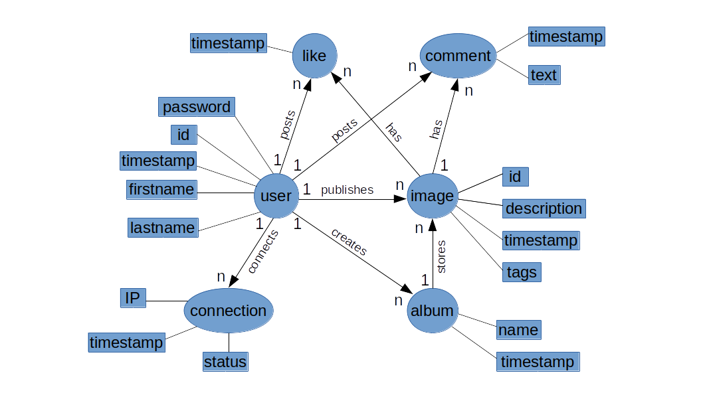
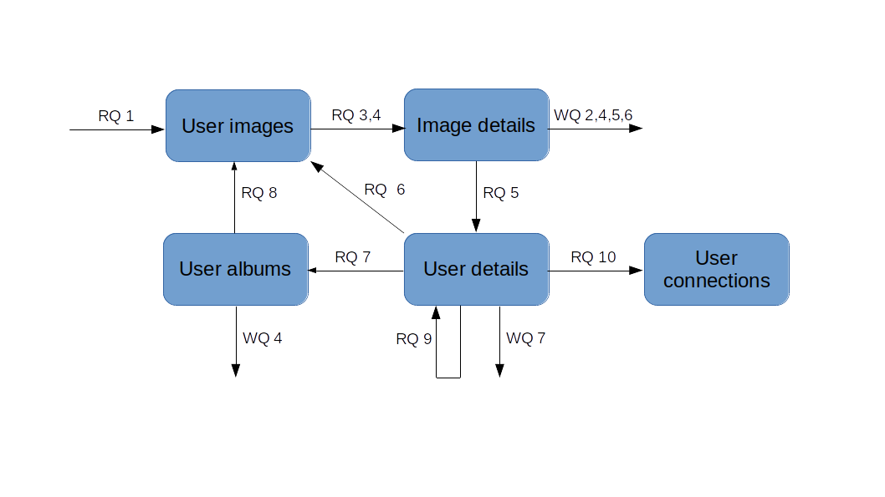
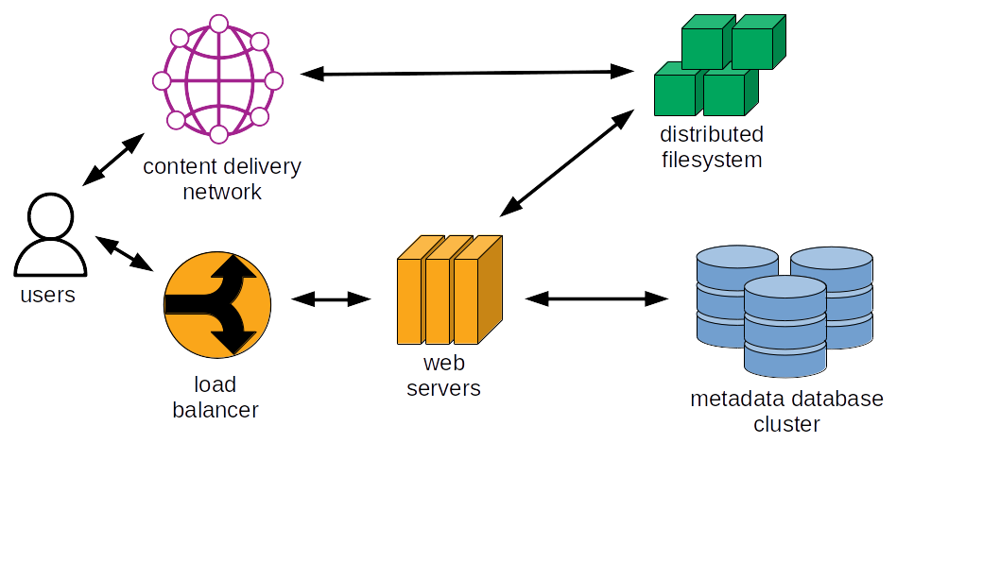

# Instagram

## 1. Requirements

### 1.1. Functional

A web application displays pictures uploaded by users.

Users can share pictures publicly.

Pictures can have tags arbitrarily chosen by users.

Users can leave comments on others' pictures, and signal they like the picture.

Pictures can be organized in albums.

Users can apply filters on pictures (black and white, enhance contrast, change
dominant color, etc.).

Users can follow each other, and be informed of pictures uploaded by people
they follow.

A picture "feed" is presented to users. This feed ranks pictures by decreasing
importance, based on whether the picture is from somebody they follow, picture
popularity, etc.

### 1.2. Non-functional

The application must be highly available.

The application must be eventually consistent, with different users seeing the
same public contents with a short lag (a few seconds at most). Consistency is
less important than availability.

Data must be store with high durability, uploaded pictures should not be lost.

## 2. Capacity estimations

A picture is 10^6 bytes on average to upload, 10^5 to download (because it is
stored downsized).

There are 10^8 daily active users.

There are 10^0 pictures uploaded per user per day, or 10^8 pictures uploaded
per day (10^3 per second). The data volume is 10^14 bytes (100TB) per day, or
10^9 bytes (1GB) per second.

There are 10^1 pictures seen per user per day, or 10^9 pictures seen per day
(10^4 per second). The data volume is 10^14 bytes (100TB) per day, or 10^9
bytes (1GB) per second.

Pictures will be compressed before storage, to a ratio of approximately 10:1.
Compressed picture storage will amount to 10^15 bytes (1PB) after a year.

## 3. Data model and queries

Capacity estimations suggest that image information represents a very high
volume of data. With an average of 10^9 images uploaded every day, and assuming
an average record size of 10^2 bytes in a table that would store image
information, this table alone would represent around 10^13 bytes (10TB) after
one year. On top of this, we estimage the database should support 10^4 (tens of
thousands) of queries per second. These requirements push the limits of what a
relational database can handle. We need a distributed database that supports
sharding and a high query throughput. Apache Cassandra is a reasonable choice.

It is difficult to design a data model to store in a database such as Cassandra
without first determining the most important query patterns. We first build a
conceptual data model, then define application queries. Then, we build the
logical (table structure) and physical (data types) data model. Finally, we
build the database schema.

### Conceptual data model

#### Objects

The following diagram describes the most important objects our application
represents, their attributes, and their relationships.

By lack of space, we cannot represent the many-to-many relationship that links
users who follow other users.



### Queries

#### Write queries

The application supports the following write queries from users:

* Query 1: Publish an image.

* Query 2: Tag an image.

* Query 3: Create an album.

* Query 4: Add an image into an album.

* Query 5: Comment an image.

* Query 6: Like an image.

* Query 7: Follow a user.

#### Read queries

When a user logs in, he is presented with a recent activity of other users.
Recent activity from followed users is presented first. We need to support the
following queries:

* Query 1: What are the images published by users I follow?

After queries 1, a user may choose to see the details of an image:

* Query 2: What are the details of an image (publication date, tags, etc.)?
* Query 3: What are the comments of an image?
* Query 4: What are the likes of an image?

A user could also be interested in the activities of a specific user:

* Query 5: What information is available about this user?
* Query 6: What images were published by this user?
* Query 7: What are the albums created by this user?
* Query 8: What images are displayed in this album?
* Query 9: Who is following me?

To prevent login attacks, we can query recent login attempts to temporarily
block an account when too many unsuccessful login attempts are made:

* Query 10: What connection attempts were made by a specific user in the past
  15 minutes?

#### Application workflow

The queries can be displayed in the context of the application workflow. Read
queries are represented by 'RQ' and write queries by 'WQ'.



### Logical and physical data model

In this section we determine what database tables we will use to support the
application queries, as well as how data is partitioned and clustered within a
partition. There are two important considerations to keep in mind: a query
should necessitate a small number of partitions (ideally one), and each row
should have a unique key (possibly by using a combination of partition and
clustering keys).

In each table, we present column names, keys, and data types. We store all
tables under a single keyspace.

Estimations in this section are based on application storage after one year,
based on throughput detailed in section 2 (capacity estimations).

For each table we will estimate the partition size defined as:

```math
N_v = N_r ( N_c - N_{pk} - N_s ) + N_s
```

With `Nv` the number of values in the partition, `Ns` the number of static
columns, `Nr` the number of rows, `Nc` the number of columns and `Npk` the
number of primary key columns. Because our capacity estimations use powers of
ten and that all tables have less than 10 columns, we consider that `Nv` is
equivalent to `Nr`.

The size on disk of partitions is calculated with the following formula:

```math
S_t = \sum_{i}sizeOf(c_{k_i}) + \sum_{j}sizeOf(c_{s_j}) + N_r \times
\big(\sum_{k}sizeOf(c_{r_k}) + \sum_{l}sizeOf(c_{c_l})\big) + N_v \times
sizeOf(t_{avg})
```

With `ck` represent key columns, `cs` static columns, `cr` regular columns, and
`cc` clustering columns. `sizeOf` is the number of bytes for the data type of
the referenced column. `tavg` is the average number of bytes of metadata stored
per cell, typically estimated at 8 bytes.

The number of bytes of each data type is taken from this StackOverflow
[post](https://stackoverflow.com/questions/40087926/what-is-the-byte-size-of-common-cassandra-data-types-to-be-used-when-calculati).

Read queries 1 is satisfied by the tables `user_follows` and `images_by_user`.

Table `user_follows`:

* `follower_id` (partition key): text
* `followed_id`: text
* `creation_timestamp`: timestamp

The partition size of `user_follows` depends on how many people a user follows,
and is estimated to be 10^1 on average. We estimate the physical partition size
to be 10^2 bytes on average, and at most 10^4 bytes (10KB). With 10^8 users,
the table size across all partitions is 10^10 bytes (10GB).

Table `images_by_user`:

* `owner_id` (partition key): text
* `album_name` (clustering key): text
* `publication_timestamp` (clustering key): timestamp
* `image_id`: uuid

Adding the clustering column `album_name` will help us take care of query 8
with the same table. Only low-level clustering columns can be queried with
range operators, so we set `album_name` as the high-level clustering column and
`publication_timestamp` as the low-level clustering column.

The partition size is proportional to the number of images owned by users. On
average, the partition size is 10^3 (1,000 images uploaded by a user),
corresponding to a physical size of 10^5 bytes (100KB). The partition size is at
most 10^4 (10,000 images), corresponding to a physical size of 10^6 bytes
(1MB). With 10^8 users, the table size is 10^13 bytes (10TB).

Read query 2 is satisfied by the table `images.

Table `images`:

* `image_id` (partition key): UUID
* `publication_timestamp`: TIMESTAMP
* `description`: text
* `album_name`: text
* `tags`: set(text)

The value of `image_id` is unique, so the partition size for this table is one,
for a physical size of 10^2 bytes. With 10^11 images stored, the physical table
size is 10^13 bytes (10TB).

Read queries 3 and 4 are satisfied by two tables: `image_comments` and
`image_likes`. Each table is partitioned by image identifier because this query
is interested in a specific image. To ensure primary key uniqueness, we add a
timestamp and user identifier as clustering keys.

Table `image_comments`:

* `image_id` (partition key): uuid
* `creation_timestamp` (clustering key): timestamp
* `user_id` (clustering key): text
* `comment_text`: text

Table `image_likes`:

* `image_id` (partition key): uuid
* `user_id` (clustering key): text
* `creation_timestamp`: timestamp

Assuming an average of 10^1 comments and likes per image, the partition size
for both `image_comments` and `image_likes` tables is 10^1 on average, for a
physical of 10^2 bytes. The size of partitions depend on image popularity and
will vary across a wide range. Assuming the most popular images gather 10^4
comments and 10^5 likes, this represents maximum partition sizes of 10^6 bytes
(1MB) for comments and 10^7 bytes (10MB) for likes. With 10^11 images, the
total table size is 10^13 bytes (10TB).

We create a table that keeps track of how many likes an image received. We use
a counter data type, so this needs to be in a separate table.

Table `image_likes_count`:

* `image_id` (partition key): uuid
* `popularity`: counter

Each image receives 10^1 likes and comments on average, so the partition size
is 10^1, for a physical size of 10^2 bytes. With 10^11 images, the total table
size is 10^13 bytes (10TB).

Read queries 5 and 6 are satisfied by the `users` table, partitioned by user
identifier (we are interested in a single user, and they are unique).

Table `users`:

* `user_id` (partition key): text
* `registration_timestamp`: timestamp
* `first_name`: text
* `last_name`: text
* `password`: text
* `album_names`: set<text>

Each user identifier is unique, so the partition size for `users` is 1, with a
physical size of 10^2 bytes. With 10^8 users, the total table size is 10^10
bytes (10GB).

Read query 7 is satisfied by the table `albums`, partitioned by album name
and album owner identifier (an album name is not unique by itself).

Table `albums`:

* `album_name` (partition key): text
* `owner_id` (clustering key): text
* `creation_timestamp`: timestamp
* `image_ids`: set<uuid>

Each of the 10^8 users have 10^1 albums, so there are 10^9 records in the
`albums` table. With 10^11 images in total, each album has 10^2 images on
average. Each record is 10^3 bytes on average, for a total table size of 10^12
bytes (1TB).

Read query 9 is satisfied by the table `user_followed`, which is an inverted
version of the table `user_follows` we saw previously.

Table `user_followed`:

* `followed_id` (partition key): text
* `follower_id`: text
* `creation_timestamp`: timestamp

The partition size of `user_followed` depends on how many people follow this
user. Popular users could have millions of followers, leading to very
imbalanced partition sizes. The largest partition, storing the most popular
user with 10^6 followers, is estimated to be 10^8 bytes (100MB). Total table
size should be similar to the table `user_follows`, 10^10 bytes (10GB).

Read query 10 is satisfied by the table `user_connections`:

* `user_id` (partition key): text
* `connection_timestamp` (clustering key): timestamp
* `user_ip`: inet
* `success`: boolean

Each user connects once per day on average, so each partition has a size of
10^2 and a physical size of 10^4 bytes (10KB). The most frequent users may
connect ten times more than average users, for a maximum partition size of
100KB. With 10^8 users, the total table size is 10^12 bytes (1TB).

In total, the described data model requires a storage of 10^14 bytes (100TB).

## 5. High-level design

### 5.1. System components

Web application servers runs the user-facing server and processes users
requests: image upload, organization into albums, browsing images of other
users, browsing the user image feed, etc.

A load balancer may be placed between clients and the application web servers,
to distribute traffic, protect web servers, and perform SSL termination.

Images are stored on a distributed filesystem, ensuring high availability and
durability.

Application data and image metadata is stored on a database. The database
engine needs to fulfill the following requirements:

* Run on a cluster of machines and support sharding and replication, because
  the application needs to store tens of terabytes of (non-image) data.
* Support a high query throughput to support the high number of application
  users.
* Availability of a Python client, to fit in our web application.

A database application such as MongoDB, DynamoDB, or Apache Cassandra would be
a good fit.

The application will be read heavy and most of the data is static (images), so
a cache layer to store image data would improve application performance. A
content-delivery network (CDN) is a good fit for this requirement. In addition
to taking care of most of data traffic, a CDN also brings data closer to users,
reducing application latency.

### 5.2. Image upload, storage, and serving

Because images are unstructured data and each have a size of at least hundreds
of kilobytes, it would not be wise to store them in a traditional database:
database size would be huge (several petabytes, see capacity estimations) and
database traffic as well.

Images are stored on a distributed filesystem to ensure high durability and
facilitate storage management.

Images are assigned a UUID before storage. After storage, the image UUID is
used as a key for retrieval.

Image metadata (owner, upload timestamp, title, tags, etc.) are stored in a
metadata database that supports richer queries.

Before storage, images are resized to a maximum width of 1080 pixels if they
exceed this width. Images are compressed to save storage costs and network
bandwidth. Also, an image thumbnail is generated and stored on the distributed
filesystem as well, to dress application icons.

An object store is a good fit for this. Some object store even allow you to
serve static data directly from storage, and readily interact with other
services such as CDN.

### 5.3. Caching

If we cache 20% of daily image traffic, it represents around 10^13 bytes
(10TB) of data. Storing this amount of information would require at least a few
tens of servers, as cloud providers offer servers with each several terabytes
of memory.

Assuming the popularity of most images will fade away with time, a
least-recently used cache expiration policy is a reasonable choice.

The application does not support image updates, so we do not need to specify a
cache invalidation policy.

The CDN will take care of caching image data for application users.

### 5.4. System diagram



### User image feed

Once logged in, a feed of images is presented to user. These images are recent
images posted by users they follow, and are ranked by increasing order of
timestamp and popularity. In other words, more recent and popular images appear
higher in the feed. If a user does not follow any user, her feed will be empty.

Image popularity is defined as the sum of the number of likes and comments on
an image.

The feed contains 100 images, or images for the past day, whatever limit is
reached first. The feed is updated daily.

To rank images, their timestamp is first truncated to hours, then images are
sorted by timestamp and ties are broken by popularity.

Because generating the feed involves querying, aggregating, and sorting data,
it takes some time to generate it and would lead to too much application
latency if the feed is generated when a user requests it. To solve this issue,
we pre-generate the feed and store it in the main application database. When a
user requests the feed, it is accessible via a simple query.

The feed is a list of items with the following attributes:

* image_id
* owner_id
* publication_timestamp

The steps to generate the feed are (for each user):

  * get the list of followed users and their albums (tables `user_follows` and
    `users`)
  * get the list of recent images of each followed user (table
    `images_by_user`)
  * rank images across followed users
  * store the ranking in a dedicated database table, partitioned by user ID

## 6. Detailed design

### 6.1. Cassandra infrastructure

AWS released a
[whitepaper](https://d0.awsstatic.com/whitepapers/AWS_Cassandra_Whitepaper.pdf)
about deploying Cassandra.

#### 6.1.1. Networking

We run Cassandra on EC2 instances deployed in a VPC. We create one subnet for
each availability zone in the AWS region, and we will place EC2 instances in at
least three availability zones.

The IP address of seed nodes is hardcoded in Cassandra configuration, so we
create Elastic Network Interfaces (ENIs) that we attach to seed nodes. If a
seed node fail, we can attach its ENI to a new node, avoiding updating the
configuration with a different IP address for the new seed node.

#### 6.1.2. Data storage

We can use EBS volumes or instance stores. Instance stores have better
performance because they are attached to the instance, but they also offer a
more limited choice of disk sizes, so we choose to store data on EBS volumes.

We use io2 EBS volumes, which are provisioned I/O operations per second (IOPS)
SSD volumes. We use two separate volumes for the commit log (250GB) and for data
(1TB). Volumes are mounted on m5.2xlarge instances, which are EBS-optimized. We
enable enhanced networking on the instances to allow more packets per second to
between the instance and the EBS volumes.

### 6.2. Cassandra configuration

Since we deployed the Cassandra cluster on EC2 instances, we used the snitch
class `Ec2MultiRegionSnitch`. We could have used `Ec2Snitch` but we prepare for
the eventual growth of the cluster beyond a single region. The datacenter name
corresponds to the AWS region in which nodes are deployed, and the rack name
corresponds to the AWS availability zone.

Here are the custom values we used in the configuration file `cassandra.yaml`
(only one seed node IP is represented):

```
cluster_name: 'Instagram'
seed_provider:
  - class_name: or.apache.cassandra.locator.SimpleSeedProvider
    parameters:
      - seeds: "172.31.23.218:7000,..."
listen_address: <node ip>
rpc_address: <node ip>
endpoint_snitch: Ec2MultiRegionSnitch
```

Here are the contents of the file `cassandra-rackdc.properties`, for a node
deployed in the us-east-1a availability zone:

```
ec2_naming_scheme: standard
dc: us-east-1
rack: us-east-1a
```

We use the data replication class `NetworkTopologyReplicationStrategy` with a
replication factor of 3. We thus create the application keyspace using:

```
CREATE KEYSPACE <keyspace name>
WITH replication = {
  'class': 'NetworkTopologyStrategy',
  'replication_factor' : 3
};
```

All tables are read-heavy instead of write-heavy workload, so we use the
[LeveledCompactionStrategy](https://cassandra.apache.org/doc/latest/cassandra/operating/compaction/lcs.html),
which allows the application to satisfy reads from a small number of SSTables,
compared to other compaction strategies. We thus create tables using the
following `CREATE TABLE` options:

```
CREATE TABLE instagram.images (
  <column definitions>
)
WITH compaction = {'class': 'org.apache.cassandra.db.compaction.LeveledCompactionStrategy'};
```

### 6.3. Web application configuration

[Gunicorn's design](https://docs.gunicorn.org/en/stable/design.html) is based
on the pre-fork worker model, in which workers are forked by a master process.
If we connect to Cassandra before workers have forked, this will lead to
timeouts when a query is executed by a worker process, and it is recommended to
[connect to Cassandra within worker
processes](https://docs.datastax.com/en/developer/python-driver/3.25/faq/#why-do-connections-or-io-operations-timeout-in-my-wsgi-application).

To do so, we customize the gunicorn server hook
[post_fork](https://docs.gunicorn.org/en/stable/settings.html?highlight=post_fork#post-fork)
and use it to connect to Cassandra. We use the following snippet in the
[configuration
file](https://docs.gunicorn.org/en/stable/configure.html#configuration-file) `gunicorn.conf.py`:

```python
import src.database


def post_fork(server, worker):
    server.log.info(f"Executing post-fork for worker {worker.pid}")
    src.database.configure_session()
    src.database.prepare_statements()
```
