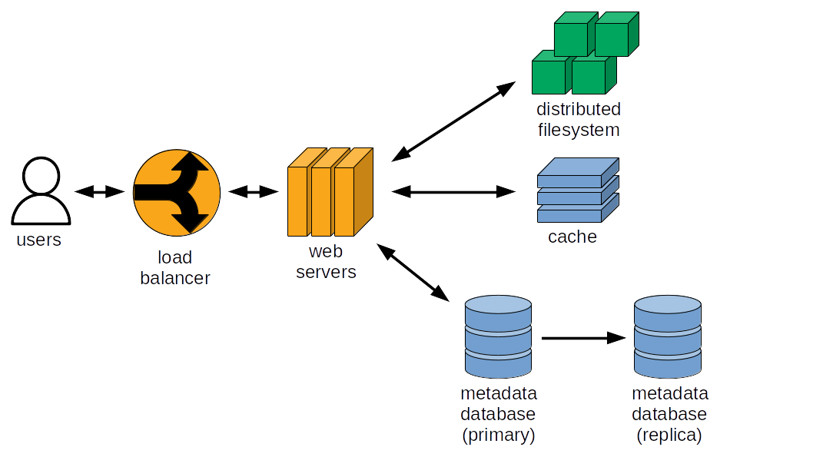

# Pastebin

## 1. Requirements

### 1.1. Functional requirements

Pastebin is a text storage and sharing web application.

Users can store texts, which are then accessible at a specific URL, and
share the URL publicly.

Texts have an adjustable expiration date after which they are deleted from the
website.

Users can signup and authenticated or store text anonymously as unauthenticated
"guests".

Users have quotas, they cannot store more than a certain number of texts per
time interval.

### 1.2. Non-functional requirements

The application should be highly available.

Availability is more important that consistency: if a group of users does not
see an update for a short period of time, it's acceptable.

Data storage durability is crucial: text uploaded by users should never be
lost.

## 2. Capacity estimations

In this section we are interested in orders of magnitude and will use power of
tens instead of exact numbers. We will put references when possible.

We will accommodate 10^8 registered users, and we expect 10^7 daily active
users

A text is 10^5 bytes on average (limited to 512 KB or 512,000 ASCII
characters).

There are 10^6 text writes per day (10^1 text writes per second, 10^8 text
writes per year), and 10^7 text reads per day (10^2 text reads per second).

Write traffic is 10^6 bytes per second on average (10^11 bytes per day). Read
traffic is 10^7 bytes per second on average (10^12 bytes per day).

Texts will be stored for up to one year, so we may store up to 10^8 texts,
totalizing 10^13 bytes (10 TB) of texts.

These estimations are consistent with capacities referenced on
[TechCrunch](https://techcrunch.com/2015/12/16/pastebin-the-text-sharing-website-updates-with-an-emphasis-on-code/).

## 3. Interface

The following functions compose the application programming interface.

`put_text` stores a text and has the following parameters:
* text_id (string): Text identifier.
* text_body (string): Text to store.
* user_id (string): User identifier.
* user_ip (string): User IP address (to identify unauthenticated users).
* ttl (string): Time to live, i.e. time interval between text creation and
  expiration.
* Returns: nothing.

`get_text` retrieves a text from storage:
* text_id (string): Text identifier.
* Returns: text (string).

`delete_text` deletes a text:
* text_id (string): Text identifier.
* Returns: nothing.

`create_user` registers a new user with the application:
* user_id (string): User identifier.
* first_name (string): First name.
* last_name (string): Last name.
* password (string): Password.
* Returns: nothing.

`get_texts_by_user` retrieves the information about the texts stored by a
specific user, to display in his profile:
* user_id (string): User identifier.
* Returns: list of text_id, creation_timestamp, expiration_timestamp.

## 4. Data model

We need to store information about users and stored texts. Texts will be stored
in a distributed filesystem for durability, and their metadata will be stored
in a database. Storing the text in an object store will allow to ease traffic
on the database and keep the metadata database size low.

The table `users` has the following columns:

* user_id (string, primary key): User identifier.
* first_name (string): First name.
* last_name (string): Last name.
* joined_on (timestamp): When the user registered.
* last_connection (timestamp): The last time the user connected.

The table `texts` has the following columns:

* text_id (string, primary key): Text identifier.
* text_path (string): Path to the text object in the filesystem.
* user_id (string): User identifier of the text creator.
* user_ip (string): IP of the text creator.
* creation (timestamp): Timestamp when the text was stored.
* expiration (timestamp): Timestamp after which the text should be deleted.
* to_be_deleted (boolean): Whether a text is marked for deletion.
* deletion (timestamp): Timestamp when the texts is deleted, after expiration.

To facilitate text deletion, we add the column `to_be_deleted` that allows
marking the text for deletion. This helps identifying situations when the text
deletion process failed and needs to be retried (discussed in a later section).

## 5. High-level design

### 5.1. Application workflow

When a user stores a text, a unique identifier is assigned to the text. This
will serve to identify the text metadata in the database and in object storage.
The application verifies that users quotas are not exceeded.  Text body is
stored in a distributed file system and text metadata (who created, when it was
created, when it expires) in the database.

When a user requests an existing text, he uses the text identifier. The
corresponding text is retrieve from storage and presented to the user.

Authenticated users can see the list of texts they previously stored. An option
to delete a text is provided, in which case the text is deleted from storage
and marked as deleted in the metadata database.

### 5.2. User quotas and text limitations

Unauthenticated users will be allowed to store 10 texts per day, while
authenticated users will be allowed 100 texts per day. We could have a paid
subscription with increased user quotas.

A text is a string of characters and can be up to 512 KB, corresponding to
64,000 ASCII characters (each taking 8 bytes to store in memory).

### 5.3 Infrastructure components

#### 5.3.1. Web application server

Application servers process client requests and display stored text to users.
For redundancy and to facilitate updates we should have at least two servers. A
load balancer could process client requests and send them to application
servers based on server health.

#### 5.3.2 Metadata database

We store metadata in two tables, `users` and `texts`. These will keep track of
user activities, as well as what texts have been stored, by who, and when we
should expire them. This use-case fits an online transactional processing
(OLTP) workload, where the application runs a lot of queries that insert or
update one or few rows.

With 10^8 users, the users table would contain 10^8 records. Assuming a record
size of 10^2 bytes, the table would store 10^10 bytes (10 GB).

With 10^8 stored texts, the texts table would contain 10^8 records. Assuming a
record size of 10^2 bytes, the table would store 10^10 bytes (10 GB).

Users and texts tables totalize 10^10 bytes (tens of GB), a modest size for a
database. In terms of throughput, we expect a few hundreds of requests per
second (mostly reads).

A relational database such as MariaDB would fulfill our requirements.

#### 5.3.3. Text storage

We expect to store tens of terabytes of text data. This is a lot of
unstructured data, which would not fit in a simple relational database setup.
A distributed database such as a key-value store would be a viable option but
would provide many more options than necessary. Our primary goal is to store
lots of unstructured data with high durability and availability, so a
distributed filesystem is a good option. We choose
[AWS S3](https://aws.amazon.com/s3/) as our text storage system.

#### 5.3.4. Caching

Most of the traffic will be reads, so we could cache texts in memory for faster
retrieval. Cache eviction can simply follow a least-recently used policy. Cache
invalidation is simple because our requirements do not include text updates, so
we simply delete a text from the cache when necessary.

### 5.4 System diagram



## 6. Detailed design

### 6.1. Web application

#### 6.1.1. Web framework

There are many [libraries](https://wiki.python.org/moin/WebFrameworks) available
to implement web applications in Python.

I initially built the application with [Flask](https://palletsprojects.com/p/flask/).
Later, I decided to rewrite the application to take advantage of concurrency
using [asyncio](https://docs.python.org/3/library/asyncio.html), so I migrated
the implementation to use [Quart](https://quart.palletsprojects.com/en/latest/).

[Gunicorn](https://gunicorn.org/) and [uvicorn workers](https://github.com/Kludex/uvicorn-worker)
server as an ASGI server. We use Gunicorn to take advantage of [server
hooks](https://docs.gunicorn.org/en/stable/settings.html#server-hooks) and
setup and teardown application resources such as connection pools (uvicorn does
not expose this functionality).

#### 6.1.2. Frontend

##### 6.1.2.1. Store a text

To store a text, users are given a
[form](https://developer.mozilla.org/en-US/docs/Web/HTML/Element/form) where
they can paste text and choose an expiration. The following code is a snippet
from `src/templates/html.index`:

```html
<form method="post">
  <label for="text-body">Write or paste up to 64,000 characters</label>
  <textarea
    name="text-body"
    id="text-body"
    row="30"
    cols="100"
    maxlength=512000
    placeholder="Write text here"
    required
  ></textarea>
  <label for="ttl">Expired after</label>
  <select name="ttl" id="ttl">
    <option value="1d">1 day</option>
    <option value="1w">1 week</option>
    <option value="1m">1 month</option>
    <option value="1y">1 year</option>
  </select>
  <input type="submit" value="Store text">
</form>
```

We then process form data in Flask (snippet adapted from `src/__init__.py`):

```python
import quart import (
    Quart,
    render_template,
    session,
)

from . import api


def create_app():
    app = Quart(__name__)

    @app.route("/", methods=("GET", "POST"))
    async def def index():
        if request.method == "POST":
            user_id = session.get("user_id", "anonymous")
            user_ip = request.headers.get(
                "X-Forwarded-For", request.remote_addr
            )
            text_id = await api.put_text(
                text_body=(await request.form)["text-body"],
                user_id=user_id,
                user_ip=user_ip,
                ttl=(await request.form)["ttl"],
            )
            msg = f"Stored text at /text/{text_id}"

            return await render_template("index.html", message=msg)

    return app
```

The function `put_text` abstracts the details about text storage and metadata
(snippet from `src/api.py`):

```python
import uuid
from datetime import datetime, timedelta

from . import database
from . import object_store

async def put_text(text_body, user_id, user_ip, ttl):
    creation_timestamp = datetime.now()
    ttl_hours = {
        "1h": 1,
        "1d": 24,
        "1w": 24 * 7,
        "1m": 24 * 30,
        "1y": 24 * 365,
    }[ttl]
    expiration_timestamp = creation_timestamp + timedelta(hours=ttl_hours)
    text_id = str(uuid.uuid4())
    await object_store.put_text(text_id, text_body)
    await database.put_text_metadata(
        text_id,
        user_id,
        user_ip,
        creation_timestamp,
        expiration_timestamp,
    )
    return text_id
```

Text IDs are generated using
[RFC 4122](https://datatracker.ietf.org/doc/html/rfc4122.html) universally
unique identifiers (UUID), so we can ensure their uniqueness.

We store the text body using the function `put_text` from the module
`object_store`, then save text metadata using the function `put_text_metadata`
from the `database` module. The `object_store` and `database` modules will be
covered in a later section.

##### 6.1.2.2. Read a text

Texts are simply displayed in an HTML [code
tag](https://developer.mozilla.org/en-US/docs/Web/HTML/Element/code) (snippet
of `src/templates/text.html`):

```html
<body>
  <pre>
    <code>{{ text_body }}</code>
  </pre>
</body>
```

The function to build the text page is simple (snippet adapted from
`src/__init__.py`):

```python
import Quart import (
    Quart,
    render_template,
    session,
)

from . import api


def create_app():
    app = Quart(__name__)

    @app.route("/text/<text_id>")
    async def get_text(text_id):
        text_body = await api.get_text(text_id)
        if text_body is None:
            abort(404)
        return await render_template("text.html", text_body=text_body)

    return app
```


The function `api.get_text` deals with retrieving texts. If it returns `None`,
this means the text ID does not exist and we return a 404 error (not found).
Otherwise we return the text. The following snippet is from `src/api.py`:

```python
from . import cache
from . import object_store


async def get_text(text_id):
    text_body = await cache.get(text_id)
    if text_body is not None:
        return text_body
    text_body = await object_store.get_text(text_id)
    if text_body is not None:
        await cache.put(text_id, text_body)
    return text_body
```

First, we try to obtain a text from cache. In case of a cache miss, we get the
text from the object store and cache results before returning them to the user.

#### 6.1.2.3 Delete a text

Users can see a list of texts they previously stored on the "My Texts" section
of the application. For each text, we display a button that allows users to
delete the text. The following snippet is from `src/template/user_texts.html`:

```html


<div class="text-item">
  <ul class="text-item-details">
    <li class="text-url">
      <a href="{{ url_for('get_text', text_id=text['text_id']) }}">{{ app_url }}{{ url_for('get_text', text_id=text['text_id']) }}</a>
    </li>
    <li class="text-creation">Created on: {{ text['creation'] }}</li>
    <li class="text-expiration>Expires on: {{ text['expiration'] }}</li>
    <form class="delete-text-form">
      <input id="text-id" class="text-id-hidden" hidden readonly value="{{ text['text_id'] }}">
      <input type="submit" class="delete-text" value="Delete text">
    </form>
  </ul>
</div>

<script>
function deleteText(form) {
  if (confirm("Do you really want to delete this text?") == true) {
    var data = new FormData();
    data.append("text-id", form.querySelector("#text-id").value);
    const delete_url = {{ url_for("delete_text")|tojson }};
    fetch(delete_url, {"method": "POST", "body": data}).then(
      (resp) => { window.location.reload() }
    );
  }
}

const forms = document.getElementsByClassName("delete-text-form");
for (var i = 0; i < forms.length; i++) {
  forms[i].addEventListener("submit", function(e) {
    e.preventDefault();
    deleteText(e.target);
  });
}
</script>


```

We add an event listener on each form "submit" action, which triggers the
function `deleteText()`. To prevent users from deleting text by mistake, we use
the [confirm()](https://developer.mozilla.org/en-US/docs/Web/API/Window/confirm)
function to control text deletion. Once confirmed, the text ID is obtained from
the hidden input field identified by `text-id` and sent via a POST request to
the URL for text deletion with the function
[fetch](https://developer.mozilla.org/en-US/docs/Web/API/Fetch_API/Using_Fetch).
We wait for the request to complete with the `then()` method and finally reload
the page to display the updated list of texts.

The following snippet shows how the request for text deletion is processed,
and is adapted from `src/__init__.py`:

```python
from datetime import datetime

import quart import (
    Quart,
    render_template,
    session,
)

from . import api


def create_app():
    app = Quart(__name__)

    @app.route("/delete-text", methods=("POST",))
    async def delete_text():
        text_id = (await request.form)["text-id"]
        user_id = await database.get_user_by_text(text_id)["user_id"]
        logged_user = session.get("user_id")
        if logged_user is None or user_id != logged_user:
            abort(403)
        await api.delete_text(
            text_id=text_id, deletion_timestamp=datetime.now()
        )
        return "OK"

    return app
```

If the request comes from an anonymous user, we abort the request with a 403
HTTP status code (not authorized). If the user is logged in but the user ID
does not match the text creator, we abort with a 403 code as well. Otherwise,
we delete the text from object storage, metadata database, and cache. The
function `api.delete_text` is implemented as:

```python
from . import cache
from . import database
from . import object_store


async def delete_text(text_id, deletion_timestamp):
    await database.mark_text_for_deletion(text_id)
    await object_store.delete_text(text_id)
    await database.mark_text_deleted(text_id, deletion_timestamp)
    await cache.delete(text_id)
```

We first mark the text for deletion with the SQL query:

```sql
UPDATE texts set to_be_delete = true WHERE text_id = %s;
```

This saves the delete action from the user in the database in case there is any
error during actual deletion, and the text will eventually be deleted from text
storage during the cleanup process (see the section about text storage). Once
the text is deleted from object storage, we record the deletion in the metadata
database using a timestamp. Finally we delete the text from cache.

#### 6.1.4. Web server infrastructure and costs

The web application will be installed on two [EC2](https://aws.amazon.com/ec2/)
instances. We choose t3.large instances with 2 vCPU and 8 GiB of memory. Our
application has no significant disk operations, a 50 GiB gp3 SSD is enough.

Application EC2 instances will be placed in a target group behind an
[application load balancer](https://docs.aws.amazon.com/elasticloadbalancing/latest/application/introduction.html).
The target group is an [autoscaling](https://aws.amazon.com/autoscaling/) group
that maintains two web application EC2 instances at all times. This increases
the availability of application: if a server becomes unavailable, a new server
will be provisioned and ready to serve requests in a few minutes. This also
allows "rolling" application updates: we manually terminate a server and the
autoscaling group will automatically provision a new updated server.

Costs are dominated by data transfers to the Internet and by EC2 instance
costs. EC2 instances cost $1,000 (reserved instances with full upfront
payment). NGINX is configured to send compressed response data, outgoing data
volume are divided by 3 compared to uncompressed capacity estimations (we send
mostly text data, which compresses very well), bringing data transfer costs to
$10,000. Total cost would then be $11,000. The application load balancer will
cost $400 per year. Autoscaling has no additional charge.

### 6.2. Metadata database

Our metadata database engine is [MariaDB](https://mariadb.org/), a 
[popular](https://db-engines.com/en/ranking/relational+dbms) and fully open
source fork of MySQL.

For durability, we will synchronously replicate the database to a standby database
server. This will allow us to quickly recover the application if the main server
becomes unavailable, at the cost of slower writes.

#### 6.2.1. Python client library

Since we are using Quart, a Python web framework based on asyncio, we need to
make sure client libraries do not block the asyncio loop. Ideally, this is
achieved by using libraries also built on asyncio, but it is not always
possible to find such libraries, so we may need to use techniques such as
multithreading to avoid blocking the asyncio loop.

The following libraries are compatible with MariaDB:

* [aiomysql](https://github.com/aio-libs/aiomysql)
  * Pros: Based on asyncio
  * Cons: Not actively maintained

* [asyncmy](https://github.com/long2ice/asyncmy)
  * Pros: Based on asyncio
  * Cons: Not actively maintained

* [mysql-connector-python](https://github.com/mysql/mysql-connector-python)
  * Pros: Reference library, continuously maintained and large community
  * Cons: Does not leverage asyncio

Of the asyncio-compatible libraries asyncmy is the most-recently active, but it
has not been updated in 6 months and I found bugs when I tested it with simple
queries. mysql-connector-python is the reference library, but does not leverage
asyncio so we will have to make sure we do not block the asyncio loop when
executing database queries (more on this below).

#### 6.2.2. Connection pools

Opening and closing a connection to MariaDB takes a non-negligible amount of
time, and is a source of significant latency when this is happening on every
application request. It is therefore beneficial to reuse a connection for
multiple database queries. However, because our application serves concurrent
requests, we would encounter conflicts when concurrent database queries try to
use the same connection and cursor. To overcome this issue, we use a connection
pool.

Gunicorn uses the [pre-fork](https://docs.gunicorn.org/en/latest/design.html)
worker model, meaning that a master process manages a set of worker processes
that are responsible for processing web requests. To avoid creating a database
connection pool in the master process (where it would be useless and consume
database resources), we manage the connection pool lifecycle with [server
hooks](https://docs.gunicorn.org/en/stable/settings.html#server-hooks).

The connection pool is initialized and accessible in a global variable when a
gunicorn worker starts by calling the function `init_connection_pool`. The pool
is destroyed when the worker stops by calling the function `close_connection_pool`.

We wrap database connections in a context manager function, to provide a simple
syntax to acquire and release connections, and to manage commits and rollbacks.

The following excerpt from `src/database.py` implements connection pooling:

```python
from . import sql_queries
from .config import config

import mysql.connector

DB_CONFIG = {
    "host": config["database"]["host"],
    "port": config["database"]["port"],
    "database": config["database"]["database"],
    "user": config["database"]["user"],
    "password": config["database"]["password"],
}

connection_pool = None


def init_connection_pool():
    global connection_pool
    if connection_pool is None:
        mysql.connector.pooling.MySQLConnectionPool(
            pool_name="pastebin",
            pool_size=config["database"]["pool_size"],
            **DB_CONFIG,
        )


def close_connection_pool():
    if connection_pool is not None:
        connection_pool._remove_connections()


@contextmanager
def connect(db_config=DB_CONFIG, dictionary=False):
    con = connection_pool.get_connection()
    cur = con.cursor(dictionary=dictionary)
    try:
        yield cur
        con.commit()
    except Exception:
        con.rollback()
        raise
    finally:
        cur.close()
        con.close()
```

There is one last problem to overcome: the library mysql-connector-python is
not based on asyncio, so its functions block the asyncio loop. To avoid this,
we can use the asyncio loop method
[run_in_executor](https://docs.python.org/3/library/asyncio-eventloop.html#asyncio.loop.run_in_executor)
to run blocking functions in separate threads. Similarly to the connection
pool, we use a thread pool. The function `execute_in_thread_pool` takes care of
acquiring a connection from the pool, executing SQL queries, and returning
results to the caller.

The following excerpt from `src/database.py` implements query executing in
threads:


```python
import asyncio
from functools import partial

thread_pool = None


def init_thread_pool():
    global thread_pool
    if thread_pool is None:
        thread_pool = ThreadPoolExecutor()


def close_thread_pool():
    if thread_pool is not None:
        thread_pool.shutdown()


async def execute_in_thread_pool(query, args=None):
    with connect(dictionary=True) as cur:
         await asyncio.get_running_loop().run_in_executor(
            thread_pool,
            partial(
                cur.execute,
                query,
                args,
            ),
        )
        return cur.fetchall()
```

We define gunicorn server hooks in the file `gunicorn.conf.py`:

```python
import src.database


def post_fork(server, worker):
    src.database.init_thread_pool()
    src.database.init_connection_pool()


def worker_exit(server, worker):
    src.database.close_thread_pool()
    src.database.close_connection_pool()
```

#### 6.2.3. Database queries

All functions of the `database` module are alike, they run a SQL query that
performs a specific step of the application workflow. For example, the function
`put_text_metadata` saves text information when a user stores a text:

```python
async def put_text_metadata(
    text_id, user_id, user_ip, creation_timestamp, expiration_timestamp,
):
    await execute_in_thread_pool(
        sql_queries.INSERT_TEXT,
        (
            text_id,
            f"{config['text_storage']['s3_bucket']}/{text_id}",
            user_id,
            user_ip,
            creation_timestamp,
            expiration_timestamp,
        ),
    )
```


We store SQL queries in a separate module to help with code readability, as SQL
queries have a tendency to spread over many lines and break the reader flow.
The query `sql_queries.INSERT_TEXT` is written as:

```
INSERT INTO texts (text_id, text_path, user_id, user_ip, creation, expiration)
VALUES (%s, %s, %s, %s, %s, %s);
```

We use the string placeholders `%s` to safely pass query parameters to the
`cursor.execute()` method. This is especially important when query parameters
are provided by application users, to avoid SQL injection.

#### 6.2.4. Text storage quotas

To enforce quotas, we need to keep track of how many texts were stored by
users. Authenticated users are identified by their user ID, and unauthenticated
users are identified by their IP address because they all share the user ID
'anonymous'. To count how many texts were created, we have two options: (1) we
store a counter for each user that we increment for each text created, (2) we
count how many texts were created by the user in the day that precedes the
request. Option 1 consumes less database resources at the cost of a more
complex application because we need to store the last time the counter was
reset, and periodically reset the counter. Option 2 consumes more database
resources because it runs an aggregation query but does not require an
additional counter and timestamp, only a simple aggregation query:

```
SELECT COUNT(*) AS quota FROM texts
WHERE user_id = %s AND creation > NOW() - INTERVAL 1 day;
```

We can improve the query performance by creating indexes on the texts table on
the columns `user_id`, `user_ip`, and `creation`.

The integrity of the users table is enforced by a primary key on `user_id`. If
a primary key violation happens when a new user register with our application,
we signal to the user that the user ID is already taken and prompt him to
choose another user ID.

The integrity of the texts table is enforced by a primary key on `text_id` and
a foreign key on user ID that references the primary key of the users table.
Given that we will need up to 10^8 text IDs and that there are 10^38 UUIDs
available (a UUID is 128 bits), we will ignore the very unlikely event of text
ID collision.

#### 6.2.5. Database infrastructure and costs

[AWS RDS](https://aws.amazon.com/rds/) supports MariaDB and has a feature
named [Multi-AZ](https://aws.amazon.com/rds/features/multi-az/) that allows
synchronous data replication on a secondary server in a different availability
zone (same geographical area but different data center).

Yearly costs for our metadata database will be around $8,200 with the following
features:
- 1 db.t3.2xlarge (8 vCPU, 32 GiB memory) RDS PostgreSQL instance.
- 1 Multi-AZ replica with the same specifications as the primary instance.
- 100 GB of gp3 SSD storage on each instance.
- 100 GB of monthly backup storage.
- RDS Proxy (connection pool).
- Instances reserved for 1 year with full upfront payment of $6,760 then $120
  monthly payments for storage and proxy costs.

### 6.3. Text storage

We estimated our storage needs in the range of tens of terabytes per year (see
capacity estimations for more details). 

[Bucket versioning](https://docs.aws.amazon.com/AmazonS3/latest/userguide/Versioning.html)
is used to guard against accidental deletions. The
[lifecycle](https://docs.aws.amazon.com/AmazonS3/latest/userguide/object-lifecycle-mgmt.html)
of objects will be configured to keep a single non-current object version for
7 days before it is permanently deleted.

#### 6.3.1. Object store interface code

Code that interacts with AWS S3 is in the module `object_storage`. The function
`put_text` stores a text in S3:

```python
import zlib

import aioboto3

from .config import config

SESSION = aioboto3.Session()
S3_BUCKET = config["text_storage"]["s3_bucket"]
TEXT_ENCODING = config["text_storage"]["encoding"]


async def put_text(text_id, text_body):
    async with SESSION.client("s3") as s3:
        await s3.put_object(
            Body=zlib.compress(text_body.encode(TEXT_ENCODING)),
            Bucket=S3_BUCKET,
            Key=text_id,
        )
```

We use the
[aioboto3](https://aioboto3.readthedocs.io/en/latest/index.html)
library to make AWS S3 requests. The
[zlib module](https://docs.python.org/3/library/zlib.html) from the Python
standard library is used to compress data before it is stored, which saves
transfer time, bandwith, and storage costs.

#### 6.3.2. Storage cleanup

When users store text, they choose a time interval after which the text expires
and is not available for reading anymore. We need a mechanism that deletes
expired texts from storage. This is necessary to keep text storage simple to
monitor, and avoid incurring unnecessary storage costs. Text deletion is
carried out by a 'cleanup' process that performs the following steps:

1. Scan the texts table in the metadata database and select the path for texts
  that are not deleted yet (column `deletion` is NULL), and where the value of
  `expiration` is smaller than the current timestamp.
2. Delete all S3 objects corresponding to the paths collected in step 1.
3. Mark the text as deleted in the metadata database by setting the current
   timestamp as a value for the column `deletion`.

It is not critical that steps 2 and 3 are atomic (succeed or fail together) so
we can keep the cleanup process simple and simply retry it in case of failure.
If an expired object is not found during step 2, we can simply skip this step
and carry on with step 3. Cleanup is performed daily at a time when load on the
system is low.

#### 6.3.3. Object storage infrastructure costs

If we use the S3 Standard storage class to store uncompressed data,
[costs](https://aws.amazon.com/s3/pricing/) would amount to around $8,600
for the first year ($5,400 for storage and $3,300 for requests). There are no
data transfer costs between S3 and other services in the same region. A rough
estimation indicates that S3 Intelligent Tiering storage would not lead to
savings, with around 20% storage cost savings (if our storage splits evenly
between frequent and infrequent access), but an additional $5,850 of monitoring
costs. Compressing data, for example using the
[zlib module](https://docs.python.org/3/library/zlib.html) of the standard
Python library, lowers data transfer time and storage volume at the expense of
more work done by the application. Assuming a compression ratio of 3 for text,
we could lower storage costs down to $1,800 per year, for a total S3 cost of
$5,100 per year.

### 6.4. Caching

The largest part of data sent by the web application is made of texts stored in
object storage. We need an in-memory cache that supports high availability.
[Redis](https://redis.io/) features
[replication](https://redis.io/docs/management/replication/) and has a
stable and well-documented Python
[client library](https://github.com/redis/redis-py), so we choose it as our
caching engine.

If we cache 20% of write traffic, this would represent in the order of 10^10
bytes (10 GB) per day. This fits easily on the memory of a single server.

Texts stored and shared usually have an initial peak of popularity which then
fades out over time. A Least-Recently Used (LRU) eviction policy is suitable
for this pattern of access, as it keeps the most recent (hence popular) data
available.

When a user requests a text, we try to retrieve the text from the cache. In the
case of a cache miss, we retrieve the text from object storage and cache it.
For cache invalidation, we simply delete a piece of data from cache when it is
deleted by a user. Our application does not allow text updates besides
deletion, so we do not have to cover more complex eviction mechanisms.

We have the options of running the caching service locally on webservers, or on
separate servers. A local cache makes sense because cache requests only come
from web servers, and would offer fast caching operations because no network
traffic would be involved (except to keep cached data consistent between
servers). Drawbacks of local caching include (1) the inability to scale web and
caching applications independently, (2) the difficulty to invalidate cached
data when texts are deleted by users (there may be cached data that is
non-local to the deletion action) or by storage cleanup (the cleanup process
would be best run outside web servers, and then requests should be sent to web
servers to invalidate cached data). To solve these issues, we deploy caching on
dedicated web servers.

The following Redis configuration parameters are used:

```
maxmemory 16gb
maxmemory-policy volatile-lru
```

We use `volatile-lru` to allow use-cases where some keys should be kept forever
(e.g. storing a counter for a rate-limiter).

For access control, we use Redis [Access Control List](https://redis.io/docs/latest/operate/oss_and_stack/management/security/acl/) and create an
application user with the following permissions:

* can perform the operations GET, SET, and DEL
* can access keys prefixed with the application name (e.g. 'pastebin')

#### 6.4.2. Cache infrastructure costs

[Amazon Elasticache](https://aws.amazon.com/elasticache/) provides a
Redis-compatible offering. Based on capacity estimations, we can deploy caching
on memory-optimized EC2 instances with around 16 GiB of memory. AWS r4, r5,
or r6 large EC2 instances fit this requirement and cost around $1,500 per year
(reserved instances with full upfront payment).

### 6.5. Total infrastructure cost

Total costs for the first year are estimated at $26,000. The share of each AWS
service in the cost is approximately:

* EC2 (including Elasticache): $12,500, 48 % of total
* S3: $5,100, 20 % of total
* RDS: $8,200, 32 % of total

Notably, costs will scale with the success of the application. The majority of
costs are due to data transfers from our system to the Internet, to display
texts to users. Another large proportion of costs are related to text storage
and requests related to text storage. Therefore, costs will be proportional to
the amount of texts stored by users and how many times stored texts are read.
